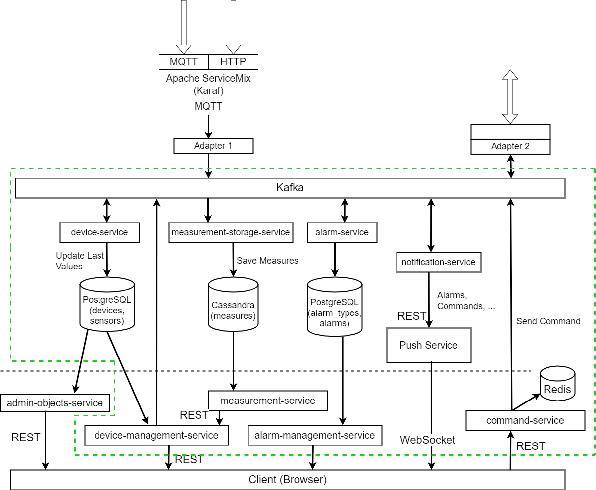

# 1. Развертывание
    helm dependency update
    helm -n auth upgrade --install --create-namespace app .
Манифесты развертываются в namespace auth

# 2. Проверка
## Выполнить Postman Collection
    newman run --insecure Microservices.postman_collection.json

# 3. Решение

В данном решении применен паттерн Хореографическая Сага.
Сервисы участвующие в Саге:
1. Device Service - компенсируемая транзакция.
2. Adapter - поворотная транзакция.
3. Notification Service - повторяемая транзакция

## Список компонентов:
1. **Command Service** - сервис отправки команд на устройство.
2. **Device Service** - сервис для обновления текущих значений параметров устройств в БД с устройствами (PostgreSQL).
3. **Alarm Service** - сервис создания алармов при поступлении новых измерений. Алармы создаются на основании необходимых условий описанных в БД сервиса (PostgreSQL).
4. **Alarm Management Service** - сервис создания типов алармов и сопутствующих необходимых условий, при возникновении которых должен быть создан аларм.
5. **Device Management Service** - сервис управления устройствами. Содержит список устройств и их сенсоров.
   Каждое устройство может содержать несколько сенсоров - каждому из них соответствует один параметр, который он измеряет (temperature, humidity и тд).
   Также сервис хранит список пользователей и групп, которым разрешен доступ к определенным группам устройств.
6. **Notification Service** - сервис уведомлений. Занимается отправкой уведомлений в различные сервисы при возникновении каких-либо событий. 
   При взаимодействии с **Push Service** в случае, если нет подключенных к **Push Service** по WebSocket пользователей, периодически пробует повторить отправку до тех пора пока не подключится хотя бы один пользователь.
7. **Push Service** - push-сервис. Отвечает за отправку уведомлений пользователям по WebSocket.
8. **Adapter(s)** - сервисы для взаимодействия с устройством. В зависимости от видов взаимодействия и устройства могут как принимать сообщения от устройств,
   так и отправлять сообщения/команды на устройства.

## Сценарии
### Отправка команды (успешная)
1. Пользователь отправляет команду для устройства на сервис Command Service.
2. **Command Service** создает событие **command.value_set** (и отправляет в **Kafka**) с текстом команды, а также сохраняет команду в список команд в список отправленных команд в Redis.
3. **Device Service** получает событие с командой, проверяет устанавливаемое значение на соответствие допустимым границам, 
обновляет текущее значение параметра в своей БД, после чего создает событие **dm.value_set_approved** в **Kafka**. В локальной транзакции выставляет статус COMMITTED.
4. Адаптер (отвечающий за взаимодействие с устройствами) получает событие **dm.value_set_approved**, отправляет полученную команду непосредственно на устройство,
а также отправляет событие **adapter.value_set_sent** в **Kafka**. В локальной транзакции выставляет статус COMPLETED.
5. **Notification Service** получает событие **adapter.value_set_sent** и отправляет его в **Push Service**.
6. **Push Service** отправляет всем подписанным клиентам по WebSocket уведомление с выполненной командой.

### Отправка команды с ошибкой
1. Пользователь отправляет команду для устройства на сервис Command Service.
2. **Command Service** создает событие **command.value_set** (и отправляет в **Kafka**) с текстом команды, а также сохраняет команду в список команд в список отправленных команд в Redis.
3. **Device Service** получает событие с командой, проверяет устанавливаемое значение на соответствие допустимым границам,
   обновляет текущее значение параметра в своей БД, после чего создает событие **dm.value_set_approved** в **Kafka**. В локальной транзакции выставляет статус COMMITTED.
4. Адаптер (отвечающий за взаимодействие с устройствами) получает событие **dm.value_set_approved**, отправляет полученную команду непосредственно на устройство, получает в ответ ошибку
   и отправляет событие **adapter.value_set_error** в **Kafka**. В локальной транзакции выставляет статус FAILED.
5. **Device Service** получает событие **adapter.value_set_error**, откатывает изменения, произведенные ранее в локальной транзакции, и выставляет статус транзакции CANCELLED.
6. **Notification Service** получает событие **adapter.value_set_sent** и отправляет его в **Push Service**.
7. **Push Service** отправляет всем подписанным клиентам по WebSocket уведомление с ошибкой по выполненной транзакции.

# Удаление развернутых ресурсов
    helm -n auth delete app 
    kubectl delete pvc --all -n auth
    kubectl delete pv --all -n auth
    kubectl delete namespace auth

Домашнее задание/проектная работа разработано(-на) для курса [Microservice Architecture](https://otus.ru/lessons/microservice-architecture)
